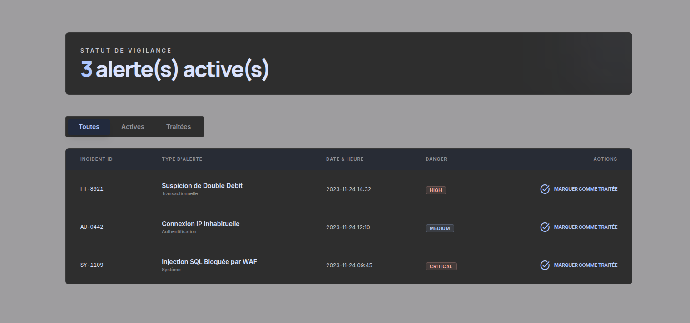

# React + TypeScript + Vite

## Instruction pour lancer le projet 

En fonction de votre gestionnaire de package (bun, npm ou pnpm) : 

```bash
bun install
bun run dev 
```

```bash
npm install
npm run dev 
```

```bash
pnpm install
pnpm run dev 
```

## Apercu de l'interface 

